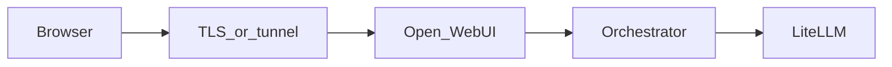

# Публичный доступ к Open WebUI для команды

**Канонический документ репозитория GPT-hub** по тому, *как* вынести Open WebUI в интернет (TLS, прокси, `WEBUI_URL`, таймауты, безопасность). Копировать ссылку на этот файл в другие репо и планы деплоя.

**Витрина и «красивый путь»** (лендинг, редирект на чат) живут в проекте сайта (например **website-scanovich.ai** / [app.scanovich.ai](https://app.scanovich.ai/)). Здесь — **исполнение стека**: Docker, env, reverse proxy / туннель к `:3000`.

Цель: открыть **только** интерфейс чата по **HTTPS**, не светя в интернет лишние порты (LiteLLM `:4000`, orchestrator `:8089`) и не кладя секреты в git.



## Обязательно на стороне Open WebUI

1. В `.env` каталога [versions_dep/v3](../versions_dep/v3) задайте публичный URL, по которому пользователи открывают UI:

   `WEBUI_URL=https://chat.example.com`

   (замените на URL туннеля или своего домена.)

2. Пересоздайте контейнер:

   `docker compose up -d --force-recreate open-webui`

3. Сильный **`WEBUI_SECRET_KEY`**.

4. При публичном доступе рассмотрите **`ENABLE_SIGNUP=false`** — см. чеклист ниже.

---

## Сценарий 1: Mac + Docker + туннель (типичный старт)

Стек крутится на **Mac**; **BGE** (эмбеддинги) и **rerank** — на Mac (`host.docker.internal`); **ASR :8001** и **instruct :8002** — на **Linux GPU**, доступ с Mac по **Tailscale**. В [versions_dep/v3/.env.example](../versions_dep/v3/.env.example) задайте (локально, без коммита реальных IP):

| Переменная | Назначение |
|------------|------------|
| `WEBUI_URL`, опционально `OR_SITE_URL` | Совпадают с публичным HTTPS |
| `LLM_INSTRUCT_API_BASE` | `http://<tailscale-gpu>:8002/v1` для LiteLLM → `gpt-hub-turbo` |
| `AUDIO_STT_OPENAI_API_BASE_URL` | `http://<tailscale-gpu>:8001/v1` для STT в WebUI |
| `BGE_EMBEDDING_UPSTREAM` | Обычно `http://host.docker.internal:9001` |
| `RAG_EXTERNAL_RERANKER_URL` | По умолчанию rerank на Mac; иначе URL на другом хосте |

Проверка с Mac: `curl -sS -o /dev/null -w '%{http_code}' http://<tailscale-gpu>:8001/` (или health вашего ASR) и то же для `:8002`.

**Туннель только к WebUI:**

- **Cloudflare Tunnel** (`cloudflared`): публичный `https://…` → `http://127.0.0.1:3000`. Шаблон конфига: [versions_dep/v3/deploy/cloudflared/config.example.yml](../versions_dep/v3/deploy/cloudflared/config.example.yml).
- **Tailscale Funnel**: публикует порт; задайте тот же **`WEBUI_URL`**, что видит браузер.

**Задачу человеку с доступом к Cloudflare** (скопировать в тикет / community): [CLOUDFLARE_TUNNEL_HANDOFF.md](CLOUDFLARE_TUNNEL_HANDOFF.md).

Минусы: Mac должен быть включён; качество домашнего канала влияет на UX.

---

## Сценарий 2: VPS и поддомен (Caddy / nginx)

Если Open WebUI слушает на VPS **`127.0.0.1:3000`**: поддомен `chat.example.com` → reverse proxy с **WebSocket** и **SSE**, большие **таймауты** чтения/отправки.

Пример **Caddy**:

```caddy
chat.example.com {
  reverse_proxy 127.0.0.1:3000
}
```

**nginx:** `proxy_http_version 1.1`, `Upgrade` / `Connection`, `proxy_read_timeout` / `proxy_send_timeout` в минутах.

### Ограничение: «голый» VPS без Mac

В [docker-compose.yml](../versions_dep/v3/docker-compose.yml) по умолчанию embedding / rerank / STT завязаны на **`host.docker.internal`** (Mac) или на ваши переопределения в `.env`. На VPS без BGE/ASR на том же хосте RAG/STT не заработают, пока не зададите другие URL или не поднимете сервисы там. Текстовый чат через LiteLLM может работать.

---

## Чеклист безопасности для командного теста

| Мера | Зачем |
|------|--------|
| `ENABLE_SIGNUP=false` или инвайты | Не открывать чат всему интернету |
| `DEFAULT_USER_ROLE=pending` + approve | Контроль доступа |
| Не публиковать `:4000`, `:8089` | Меньше поверхность атаки |
| Сильные пароли админа | Базовая гигиена |
| HTTPS через туннель / прокси | Куки и сессии WebUI |

Детали: [versions_dep/v3/README.md](../versions_dep/v3/README.md), [versions_dep/v3/.env.example](../versions_dep/v3/.env.example).

## Связь с отдельным продуктом (например Scanovich)

Streamlit и Open WebUI — разные процессы; на лендинге — ссылка на URL чата. Handoff для другого репо: [AGENT_HANDOFF_SCANOVICH.md](AGENT_HANDOFF_SCANOVICH.md).
