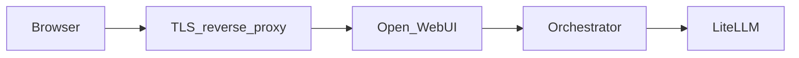

# Публичный доступ к Open WebUI для команды

**Канонический документ репозитория GPT-hub** по тому, *как* вынести Open WebUI в интернет (TLS, прокси, `WEBUI_URL`, таймауты, безопасность, VPS vs Mac). Копировать ссылку на этот файл в другие репо и планы деплоя.

**Витрина и «красивый путь»** (лендинг, страница `/MTSGPTHub`, редирект на чат) живут в проекте сайта (например **website-scanovich.ai** / [app.scanovich.ai](https://app.scanovich.ai/)). Здесь — только **исполнение**: Docker, env, reverse proxy / туннель к `:3000`.

Цель: открыть **только** интерфейс чата по **HTTPS**, не светя в интернет лишние порты (LiteLLM `:4000`, orchestrator `:8089`) и не кладя секреты в git.

Типичная цепочка:



## Обязательно на стороне Open WebUI

1. В `.env` каталога [versions_dep/v3](../versions_dep/v3) задайте публичный URL, по которому пользователи открывают UI:

   `WEBUI_URL=https://chat.example.com`

   (замените на свой хост или URL туннеля.)

2. Пересоздайте контейнер, чтобы подтянуть переменные:

   `docker compose up -d --force-recreate open-webui`

3. Сильный **`WEBUI_SECRET_KEY`** (уже в `.env.example` как обязательное поле).

## Вариант A: VPS и поддомен (рядом с другим приложением)

Подойдёт, если у вас уже есть сервер с TLS (например под [app.scanovich.ai](https://app.scanovich.ai/)): выделите поддомен вроде `chat.yourdomain.com` и проксируйте на `127.0.0.1:3000`, где слушает контейнер Open WebUI.

**Важно для WebUI:** нужны **WebSocket** и **длинные ответы (SSE)**. Для nginx/Caddy обычно:

- заголовки `Upgrade` и `Connection` для WebSocket;
- достаточно большие **таймауты** чтения/отправки (чат и стриминг минутами), иначе обрывы посреди ответа.

Пример идеи для **Caddy** (замените домен и путь к сертификатам по вашей схеме):

```caddy
chat.example.com {
  reverse_proxy 127.0.0.1:3000
}
```

Caddy по умолчанию корректно пробрасывает WebSocket. Для очень длинной генерации при необходимости увеличьте таймауты в конфиге Caddy.

Для **nginx** используйте `proxy_http_version 1.1`, `Upgrade`/`Connection`, `proxy_read_timeout` / `proxy_send_timeout` в минутах (значения подберите под свои модели).

**Не обязательно** публиковать наружу `:4000` и `:8089`: браузер ходит только в WebUI; WebUI внутри Docker-сети обращается к orchestrator и далее к LiteLLM.

### Ограничение: RAG и ASR на «голом» VPS

В [docker-compose.yml](../versions_dep/v3/docker-compose.yml) по умолчанию **embedding**, **rerank** и **ASR** указывают на `host.docker.internal` (часто — сервисы на вашем Mac в LAN). На VPS без этих процессов RAG/STT **не заработают**, пока не зададите реальные URL в `.env` (облачные или другие хосты) или не поднимете те же сервисы на этом сервере. Текстовый чат через LiteLLM при этом может работать.

## Вариант B: домашняя машина с Docker — туннель

Если стек крутится локально:

- **Cloudflare Tunnel** (`cloudflared`): зарегистрируйте туннель, маршрут `https://…` → `http://localhost:3000`, включите TLS на стороне Cloudflare.
- **Tailscale Funnel** (или аналог): публикует выбранный порт на ваш tailnet-URL; задайте тот же **`WEBUI_URL`**, что видит браузер.

Секреты и ключи API храните только в `.env` на машине; в репозиторий не коммитьте URL с реальными IP Tailscale и токены (см. правила безопасности git в проекте).

## Чеклист безопасности для командного теста

| Мера | Зачем |
|------|--------|
| `ENABLE_SIGNUP=false` или регистрация только по инвайту | Не открывать чат всему интернету |
| `DEFAULT_USER_ROLE=pending` + ручной approve в админке | Контроль, кто входит |
| Не экспонировать LiteLLM/orchestrator без необходимости | Меньше поверхность атаки и утечки ключей |
| Уникальные пароли админа, не дефолтные | Базовая гигиена |
| HTTPS только через reverse proxy / туннель | Шифрование и нормальные куки WebUI |

Детали переменных: [versions_dep/v3/README.md](../versions_dep/v3/README.md), [versions_dep/v3/.env.example](../versions_dep/v3/.env.example).

## Связь с отдельным продуктом (например Scanovich)

Streamlit-приложение и Open WebUI — **разные процессы**. Практичный вариант: на лендинге или в приложении дать ссылку «Открыть командный чат» на поддомен с WebUI, без встраивания WebUI внутрь Streamlit в одном процессе (если нет отдельного ТЗ на embed).

Handoff для агента другого репозитория: [AGENT_HANDOFF_SCANOVICH.md](AGENT_HANDOFF_SCANOVICH.md).
